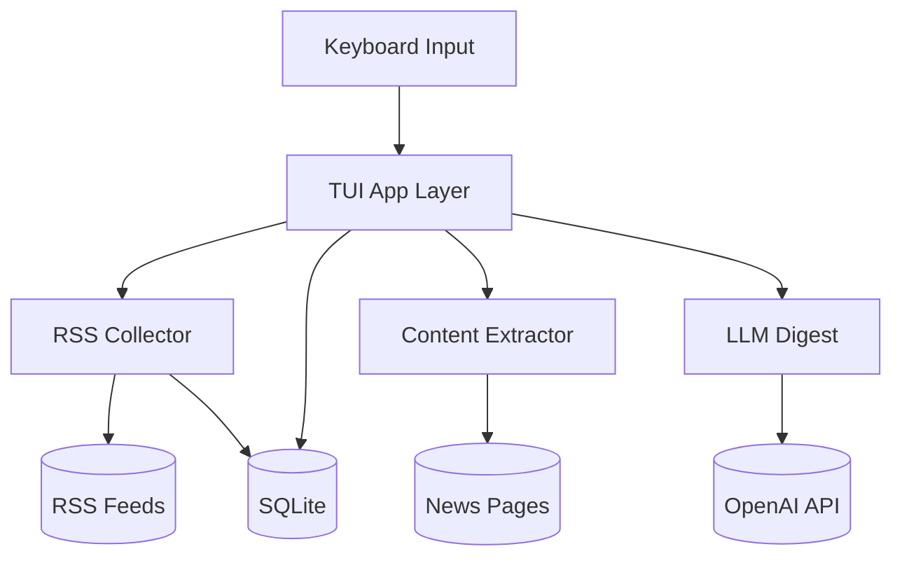

Last updated: 2026-10-06

> [!NOTE]
> This README was generated by [SKILL](https://github.com/agenvoy/skill-readme-generate), get the ZH version from [here](./doc/README.zh.md).

***

<strong>READ THE NEWS, NOT THE NOISE, RIGHT IN YOUR TERMINAL!</strong>

***

> A Go terminal RSS reader with full-article extraction, SQLite offline cache, and rolling LLM news digest

## Table of Contents

- [Features](#features)
- [Architecture](#architecture)
- [License](#license)
- [Author](#author)

## Features

> `git clone https://github.com/pardnchiu/go-rss-reader && cd go-rss-reader && go build -o RSSReader ./cmd/cli` · [Documentation](./doc/doc.md)

- **Reader-Mode Extraction** — Fetches the original article page, strips ads, navigation, and comments, and isolates the body by link density so you read the full story in the terminal.
- **SQLite Offline Cache** — Feeds, full article text, and the LLM digest live in a single SQLite file, so restarts load the last 72 hours of news instantly without waiting on the network.
- **Rolling LLM Digest** — After each batch of new articles is stored, gpt-4o-mini updates the previous digest incrementally into categorized headlines with trend-change notes.
- **Keyboard-Driven Four-Pane TUI** — Summary, list, preview, and command panes switch with Tab, refresh automatically every 5 minutes, and open the source in your browser with Ctrl+O on any OS.
- **In-App Feed Management** — Type add, rm, apikey, or config in the command pane to manage feeds and the API key without touching a config file.

## Architecture

> [Full Architecture](./doc/architecture.md)

## License

This project is licensed under the [MIT LICENSE](LICENSE).

## Author

Just [open an issue](https://github.com/pardnchiu/go-rss-reader/issues/new) to share an idea.

***

©️ 2025 [邱敬幃 Pardn Chiu](https://www.linkedin.com/in/pardnchiu)
