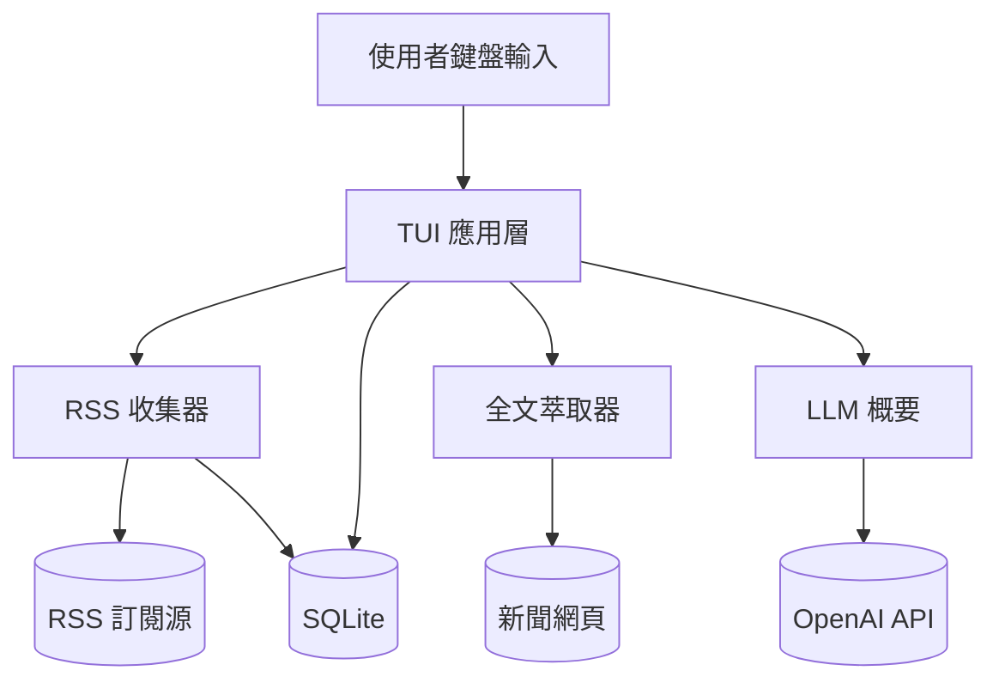

最後更新：2026-10-06

> [!NOTE]
> 此 README 由 [SKILL](https://github.com/agenvoy/skill-readme-generate) 生成，英文版請參閱 [這裡](../README.md)。

***

<strong>READ THE NEWS, NOT THE NOISE, RIGHT IN YOUR TERMINAL!</strong>

***

> Go 終端 RSS 閱讀器，具備全文萃取、SQLite 離線快取與 LLM 滾動新聞概要

## 目錄

- [功能特點](#功能特點)
- [架構](#架構)
- [授權](#授權)
- [Author](#author)

## 功能特點

> `git clone https://github.com/pardnchiu/go-rss-reader && cd go-rss-reader && go build -o RSSReader ./cmd/cli` · [完整文件](./doc.zh.md)

- **閱讀模式全文萃取** — 自動抓取原始新聞頁，剔除廣告、導覽與留言，並以連結密度篩出正文，在終端直接讀完整篇文章。
- **SQLite 離線快取** — 訂閱源、文章全文與 LLM 概要皆存於單一 SQLite 檔，重新啟動即刻載入近 72 小時新聞，不需等待網路。
- **LLM 滾動式新聞概要** — 每批新文章入庫後，帶入前次概要交由 gpt-4o-mini 增量更新，產出分類要聞與趨勢變化對照。
- **鍵盤驅動四欄 TUI** — 摘要、列表、預覽、指令四區以 Tab 切換，每 5 分鐘自動檢查更新，Ctrl+O 跨平台以瀏覽器開啟原文。
- **介面內管理訂閱源** — 在指令欄輸入 add、rm、apikey、config 即可增刪 RSS 源與設定 API 金鑰，無需編輯設定檔。

## 架構

> [完整架構](./architecture.zh.md)

## 授權

本專案採用 [MIT LICENSE](../LICENSE)。

## Author

Just [open an issue](https://github.com/pardnchiu/go-rss-reader/issues/new) to share an idea.

***

©️ 2025 [邱敬幃 Pardn Chiu](https://www.linkedin.com/in/pardnchiu)
