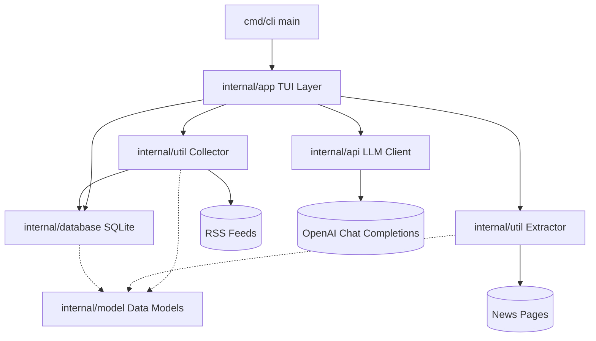
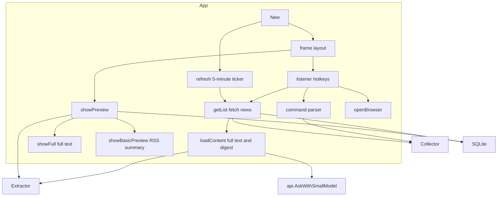
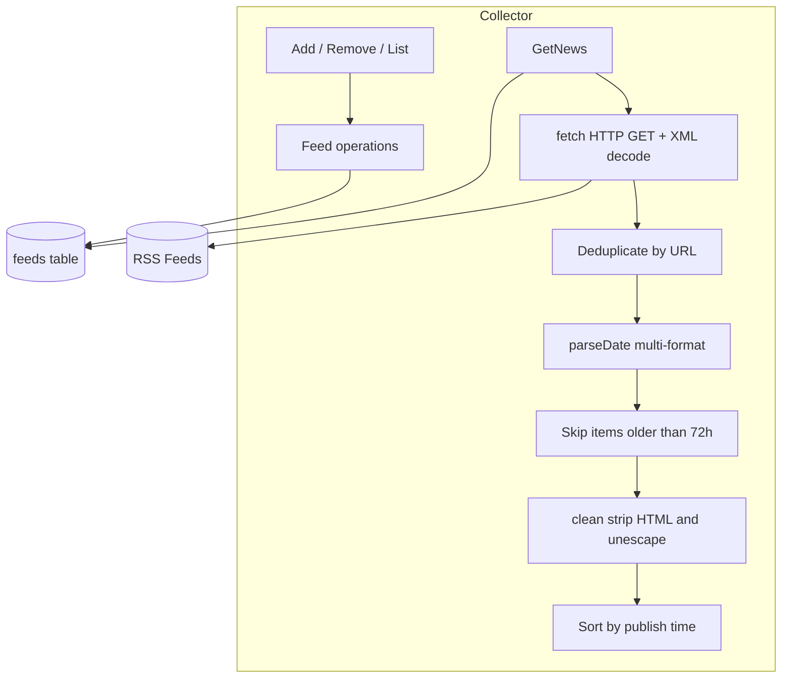
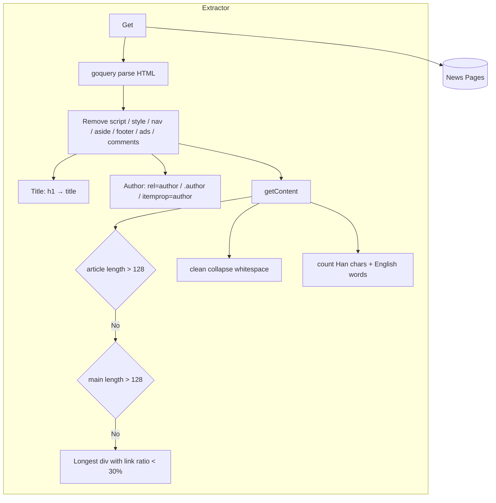
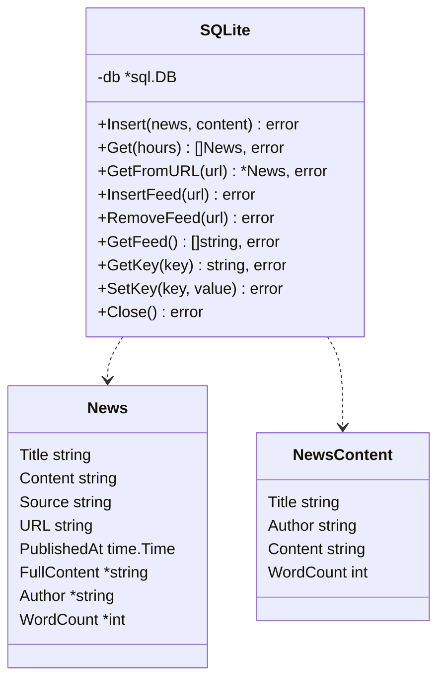
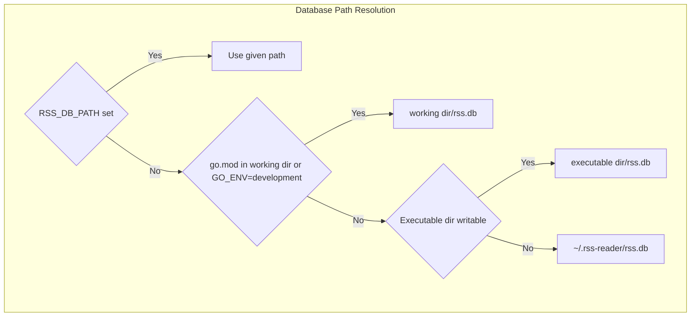
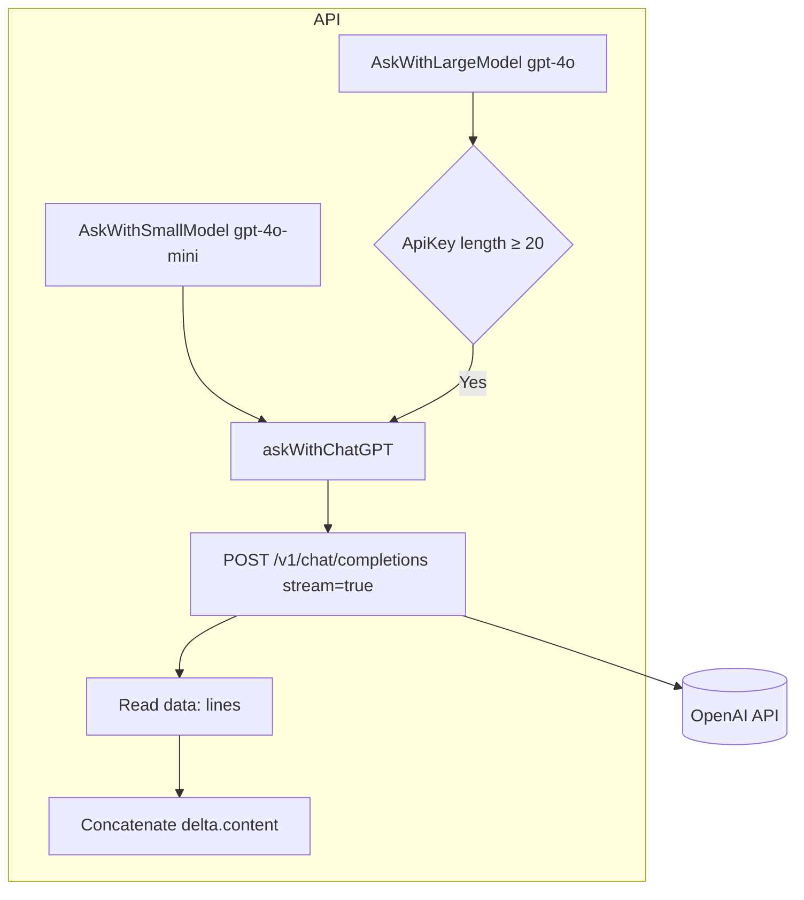
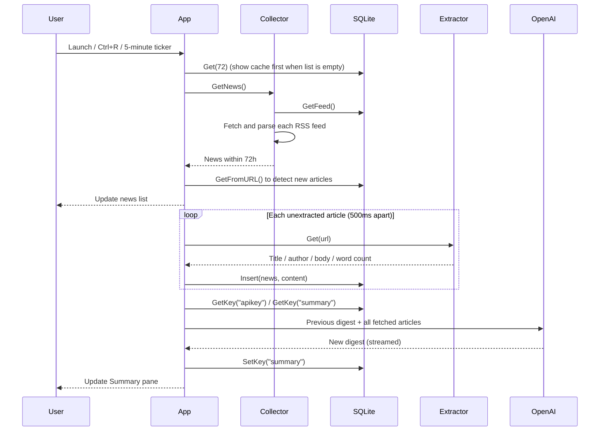
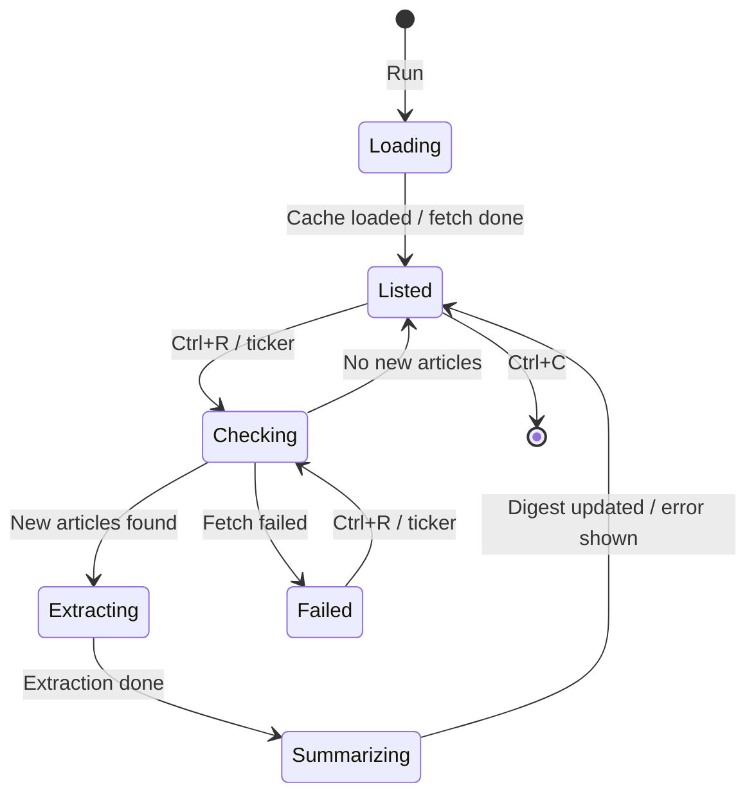

# go-rss-reader - Architecture

Last updated: 2026-10-06

> Back to [README](../README.md)

## Overview

## Module: App

Builds the tview interface, handles hotkeys and commands, and orchestrates collection, extraction, storage, and the digest.

## Module: Collector

Manages feeds and fetches, parses, deduplicates, and filters RSS items.

## Module: Extractor

Extracts title, author, and body from a news page and counts words.

## Module: Database

SQLite access layer: resolves the database location, creates tables, and handles CRUD.

## Module: API

Calls OpenAI Chat Completions in streaming mode, parses SSE line by line, and assembles the reply.

## Data Flow

## State Machine

***

©️ 2025 [邱敬幃 Pardn Chiu](https://www.linkedin.com/in/pardnchiu)
