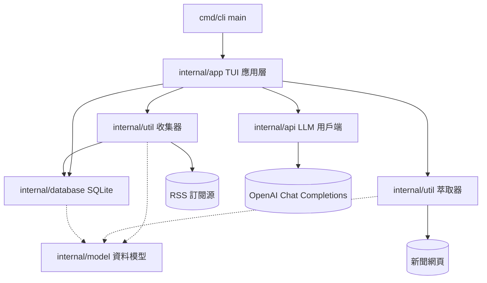
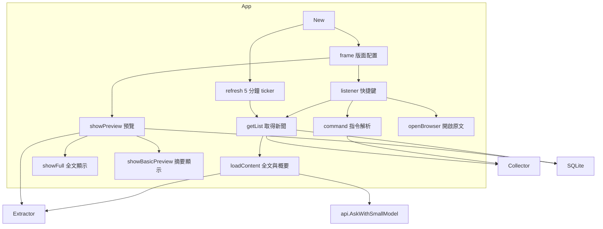
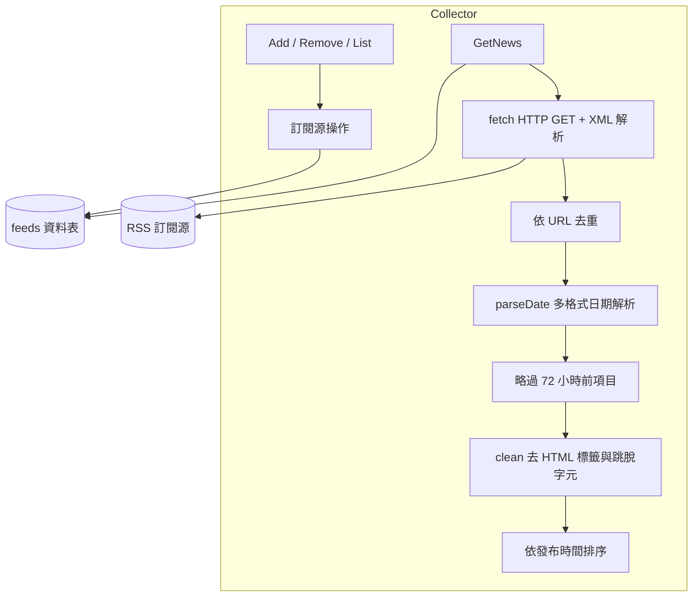
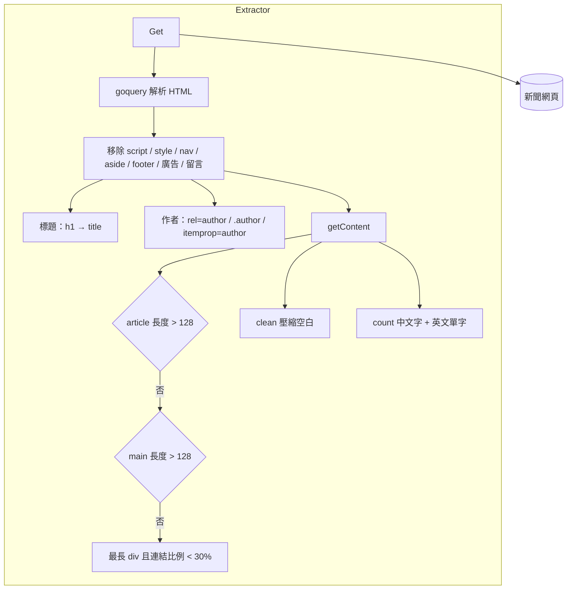
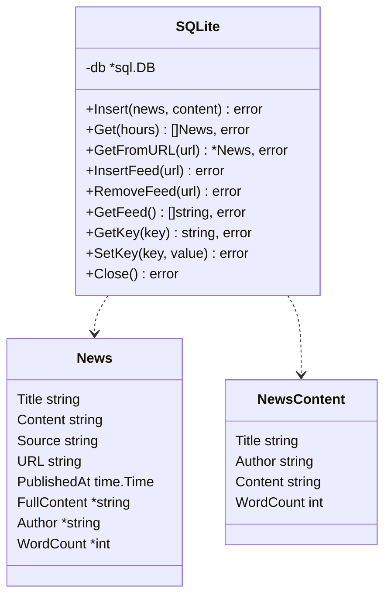
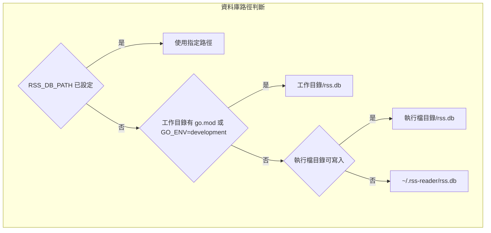
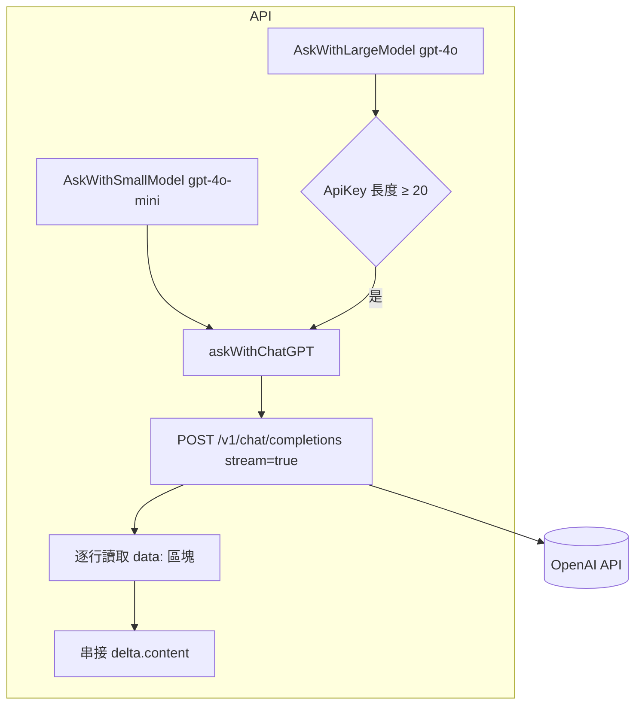
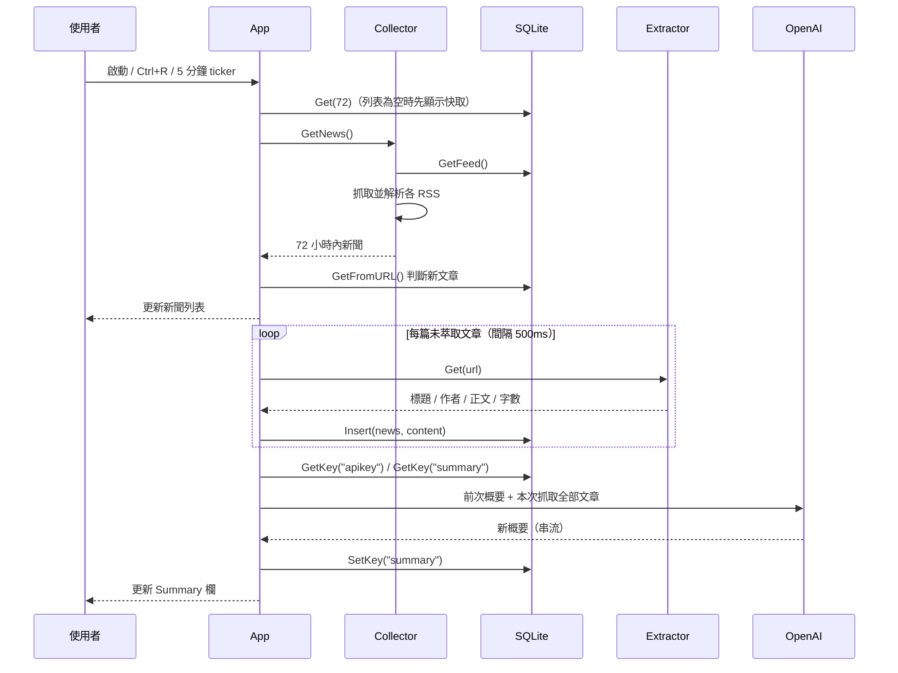
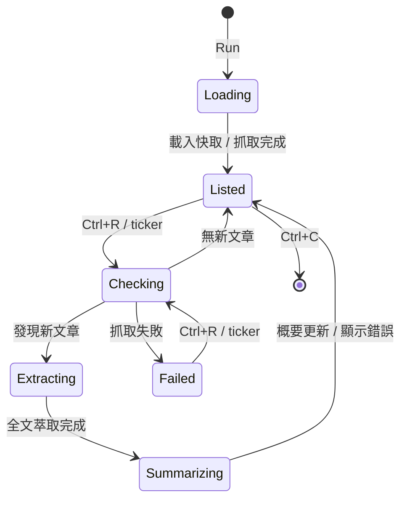

# go-rss-reader - 架構

最後更新：2026-10-06

> 返回 [README](./README.zh.md)

## 概覽

## 模組：App

建立 tview 介面、處理鍵盤事件與指令，並協調收集、萃取、儲存與概要流程。

## 模組：Collector

管理訂閱源並抓取、解析、去重、篩選 RSS 項目。

## 模組：Extractor

從新聞網頁萃取標題、作者與正文，並計算字數。

## 模組：Database

SQLite 存取層，負責資料庫位置判斷、建表與 CRUD。

## 模組：API

以串流方式呼叫 OpenAI Chat Completions，逐行解析 SSE 並組合回應。

## 資料流

## 狀態機

***

©️ 2025 [邱敬幃 Pardn Chiu](https://www.linkedin.com/in/pardnchiu)
